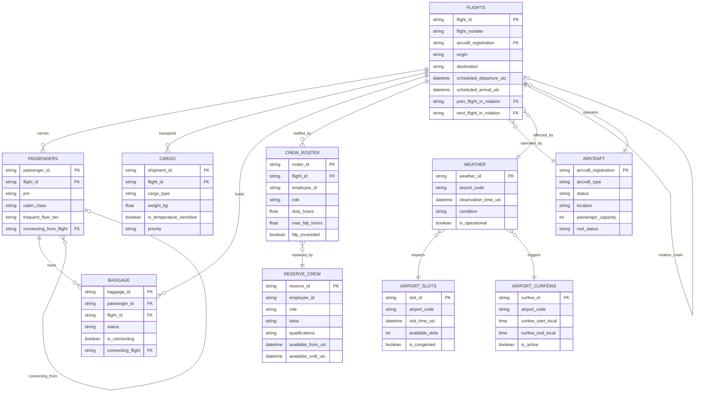
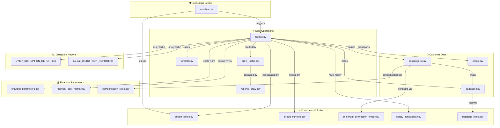
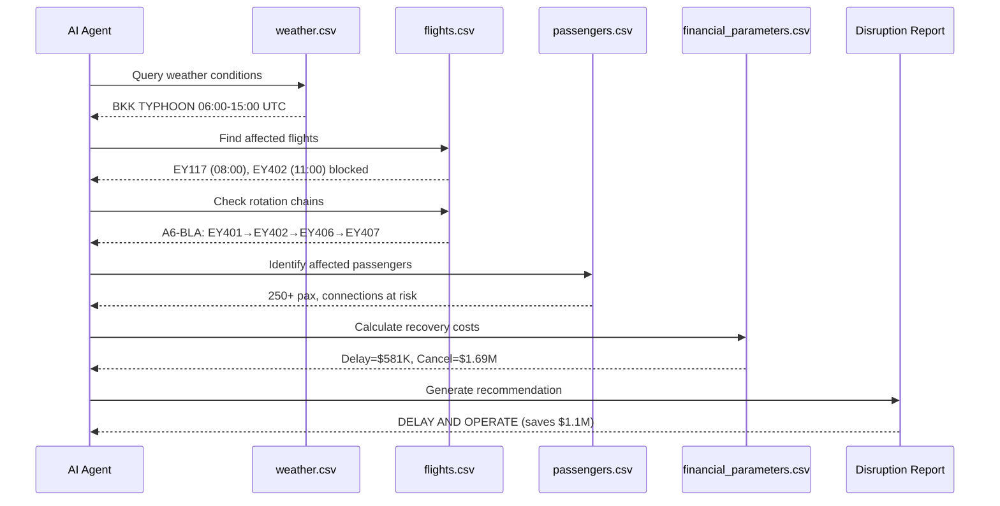

# SkyMarshal Data Relationship Diagram
## Output2 Dataset - Airline Disruption Recovery System

**Frozen Point:** January 30, 2026 00:00H (UTC+4 Abu Dhabi)  
**Purpose:** AI-driven dynamic disruption discovery and recovery optimization

---

## Entity Relationship Diagram (Mermaid)

---

## Data Flow Diagram

---

## Key Relationships Summary

| Primary Entity | Related Entity | Relationship | Join Key |
|----------------|----------------|--------------|----------|
| flights | aircraft | Many-to-One | aircraft_registration |
| flights | flights | Self-reference | prev/next_flight_in_rotation |
| flights | weather | Many-to-One | origin/destination ↔ airport_code |
| passengers | flights | Many-to-One | flight_id |
| passengers | passengers | Self-reference | connecting_from_flight |
| baggage | passengers | Many-to-One | passenger_id |
| baggage | flights | Many-to-One | flight_id |
| cargo | flights | Many-to-One | flight_id |
| crew_roster | flights | Many-to-One | flight_id |
| reserve_crew | crew_roster | Replacement | base, qualifications |
| airport_slots | weather | Impacted by | airport_code |
| airport_curfews | flights | Constrains | airport_code |

---

## Disruption Discovery Flow

---

## File Inventory

| File | Records | Primary Key | Description |
|------|---------|-------------|-------------|
| flights.csv | 87 | flight_id | Flight schedule with rotation links |
| aircraft.csv | 20 | aircraft_registration | Fleet with MEL status |
| passengers.csv | 100 | passenger_id | Passenger manifest with connections |
| crew_roster.csv | 42 | roster_id | Crew assignments with FDP tracking |
| reserve_crew.csv | 34 | reserve_id | Standby crew pool |
| cargo.csv | 80 | shipment_id | Cargo manifest with temp requirements |
| baggage.csv | 65 | baggage_id | Baggage tracking with transfers |
| weather.csv | 86 | weather_id | Weather observations (disruption seeds) |
| airport_slots.csv | 83 | slot_id | Slot availability |
| airport_curfews.csv | 4 | curfew_id | Night curfew rules |
| minimum_connection_times.csv | 52 | mct_id | MCT by airport/connection type |
| financial_parameters.csv | 100 | parameter_id | Cost parameters |
| recovery_cost_matrix.csv | 58 | matrix_id | Recovery option costs |
| compensation_rules.csv | 40 | rule_id | EU261/DOT/UAE compensation |
| safety_constraints.csv | 70 | constraint_id | Regulatory safety rules |
| baggage_rules.csv | 40 | rule_id | Baggage handling rules |

---

## Weather Disruption Seeds (Jan 30, 2026)

| Airport | Condition | Window (UTC) | Impact |
|---------|-----------|--------------|--------|
| **BKK** | TYPHOON | 06:00-15:00 | Airport CLOSED |
| **LHR** | FOG | 06:00-12:00 | Airport CLOSED |
| **CDG** | SNOW_STORM | 06:00-15:00 | Airport CLOSED |
| **SIN** | THUNDERSTORM | 12:00-18:00 | Operational but degraded |
| **AUH** | SANDSTORM | 09:00-15:00 | Operational but degraded |

---

*Generated for SkyMarshal AI Recovery System*  
*Data frozen at: January 30, 2026 00:00H UTC+4*